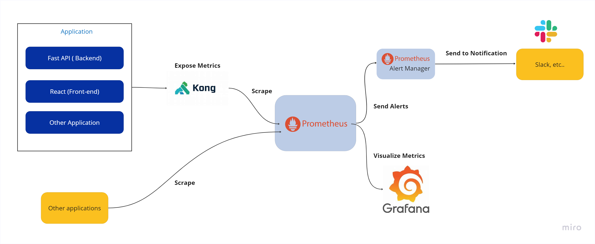

# Monitoring and Alerting


Monitoring and alerting refer to the process of continuously tracking and analyzing system metrics and data in real-time to detect and alert on various types of issues or anomalies. Monitoring involves collecting and analyzing data from various sources such as servers, networks, applications, and services, while alerting involves notifying IT teams of issues or events that require immediate attention or remediation.

## Architecture Diagram:



## Why do we go for Monitoring and Alerting tools?

Monitoring and alerting tools are used to help ensure the reliability and availability of computer systems, networks, and applications. These tools are designed to detect and alert on various types of events and issues, such as system failures, errors, performance degradation, security threats, and other anomalies.


* Resource utilization monitoring
* Forecasting future resource needs
* Performance metric analysis
* Optimization identification
* System performance improvement
* Compliance monitoring
* Security threat detection
* Vulnerability monitoring
* Industry regulation compliance
* Data breach prevention


## Required stack for development:

* Prometheus
* Alertmanager
* Grafana

Prometheus collects the metrics data from the different sources using its powerful query language, PromQL, which allows users to easily query and analyze collected metrics.

Alertmanager allows users to define alerting rules that specify the conditions under which an alert should be generated. When an alert is triggered, Alertmanager evaluates the routing tree to determine which receivers should receive the alert. It then sends the alert to those receivers, either as an email, a webhook, or some other format.

Grafana is an open-source data visualization and monitoring tool that can be used to create dashboards and panels to display metrics and analytics from various data sources. It is highly customizable and supports a wide range of data sources, including Prometheus, Elasticsearch, Graphite, InfluxDB, and many others.


## How to Setup the Project?


## Project folder Structure:


```text
Clk-moniter

├── Volumes

│   ├── alertmanger              # Directory Config files of alertmanager

│         │          ├── alertmanger.yml     # yaml files for alermanager

│        ├── prometheus               # Directory Config of prometheus

│        │    ├──config

│                        ├── alert.rules.yml  # yaml files for rules

│                        ├── prometheus.yml         # yaml files for prometheus

├── Dockerfile                                         # Docker file for Kong

├── docker-compose.yml           # Used for docker-compose

├── .env

├── .gitignore

└── Readme.md
```


In this case we are using docker to setup the projects in the local machine.

1. Install Docker and Docker-compose

https://docs.docker.com/get-docker/

2. Check docker and docker-compose installed or not

For docker

docker - -version


For docker-compose


docker-compose - -version


3. Checkout the project from the github using the below command:


git clone https://github.com/arockiyastephenl/Clk-Moniter.git


4. You can start the “Auto\_script.sh” shellscript in your command prompt or run the below cmd one by one


docker-compose build kong

docker-compose up -d kong-db

docker-compose run --rm kong kong migrations bootstrap

docker-compose run --rm kong kong migrations up

docker-compose up -d kong

docker-compose ps

docker-compose up -d konga

sleep 2m

docker-compose up -d keycloak-db

docker-compose up -d keycloak

docker-compose up -d alertmanager

docker-compose up -d prometheus

docker-compose up -d grafana

docker-compose ps


5. Verify the services
* Prometheus
* http://localhost:9090/targets


* http://localhost:9090/rules


* Alertmanager
* http://localhost:9093


* Grafana
* http://localhost:3000
* admin/admin


* Slack Notification


